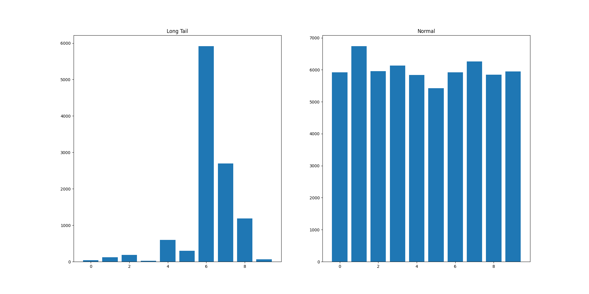
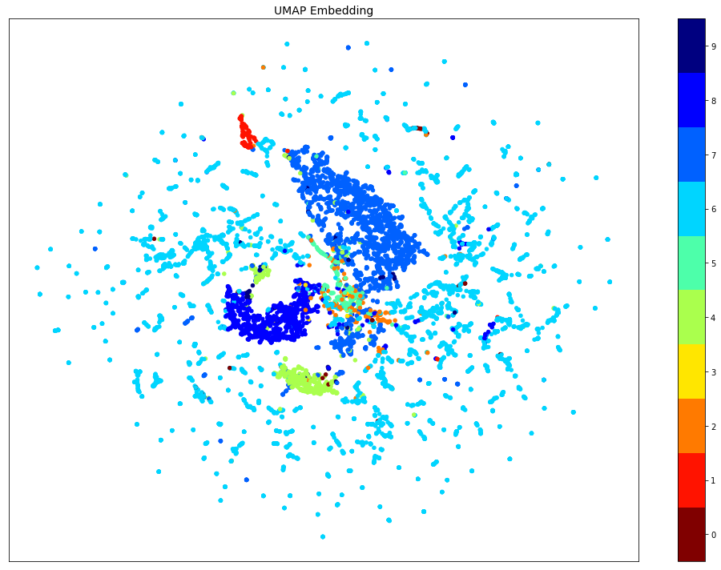

## Introduction
<br>
<br>

This repository presents an independent implementation of the paper [Decoupling Representation and Classifier for Long-Tailed Recognition](https://arxiv.org/abs/1910.09217). This paper proposes some widely used baselines for long-tail classification. In fact, it is an interesting paper that tackle specific problems observed when training a feature representation + classifier in different long-tail datasets. In special, the authors proposed the following baselines:
<br>
<br>

- Classifier re-training: re-train only the classifier part while freezing the feature extractor. This stage is performed using a balanced batch generator - equal number of samples for each class. It is two-stage approach.
<br>

- Nearest Class Mean Classifier (NCM) : it is a simple baseline that assigns the class based on the nearest mean class represantion. 
<br>

- $\tau$-normalized : It is based on the observation that the norm of the weights corresponding to a specific class ($w_i$) are correlated with the number of samples of that class. Thus, they normalize the class-weights accordingly with the hyperparameter $\tau$.
<br>

- Learnable weight scaling (LWS) : it is learnable version of the $\tau$-normalized, where the scaling factors are learned while all the remaining parameters are fixed. It is a two-stage approach where we first learn the model and, then, learn the scaling factors ($f$).
<br>

In addition to the baselines, the authors also evaluated a baseline model trained with distinct sampling strategies. Here, we implemented the all except the Progressively-balanced. They are briefly explained in the following:
<br>
<br>

- Instance-balanced sampling. All samples have equal possibility to be sampled. As the dataset is long-tailed, it will generated batches with very dissimilar number of samples per class.
<br>

- Class-balanced sampling. All classes have equal probability to be sampled to obtain the batch. The number of samples is approx. the same for each class. Samples from rare class are sampled several times during a single epoch.
<br>

- Square-root sampling. A modification of the instance-balanced where we alleviate the difference between head and tail classes.
<br>


In all the experiments, we used the MNIST-LT as toy-dataset to validate our implementation. We encorage others to validate in more challenging datasets. 
<br>
<br>

### MNIST-LT

<br>
<br>

The MNIST-LT is a long-tail version of the MNIST dataset that I used in these experiments. It is not the ideal scenario to evaluate long-tail classification as the MNIST does not have a large intraclass variance and small interclass similarity. The distribution of samples per label in the MNIST-LT obtained using the pareto distribution is presented in the Figure 2. To obtain the head, medium and tail groups, we used the threshold of 100 and 1000. It means that classes with fewer samples than 100 are clustered in the tail group, between 100 and 1000 are clustered in the medium and above 1000 are in the head cluster.

<br>


<center> Figure 2. Distribution of the number of samples per class in the MNIST-LT.</center>

<br>
<br>


## To run
<br>
<br>

In order to run experiments similarly to the original paper, we consider two scenarios: training the baseline model with different sampling strategies and running the different baselines.
<br>

Different sampling strategies:

```
python main.py -m balanced -s instance_balanced
python main.py -m balanced -s cls_balanced
python main.py -m balanced -s sqrt
```

<br>
Different baselines:

```
python main.py -m cls_retrain
python main.py -m nmc
python main.py -m t-normalized
python main.py -m lws
```
<br>
<br>

## Experimental results
<br>

Evaluating the sampling strategies. Considering only the simple model (feature extraction + classification) with different sampling strategies, we obtained the experimental results presented in Table 1. From these, we conclude that for the MNIST-LT settings, it is better to construct batches with a balanced number of samples per class. Surprisingly, it is only marginally better than using an instance-based approach. We related that to the batch_size (128), which is large enough to have a minimal number of samples for each class. For instance, for a batch size of 32, the instance based achieves 83.56% against 92.14% of the class-balanced strategy. 
<br>

Tabel 1. Different Sampling Strategies.
| Baseline | Norm. Acc (%) |
|----------|-----------|
| instance | 89.26     |
| class    | 91.23     |
| squared  | 90.57     |

<br>
<br>

Evaluating the different baselines. The obtained experimental results are shown in Table 2, where we notice that the classifier retraining (cRT) is the one with the best results. Differently, the NMC is the only method that degradates the inital results of the model. We credit that to the very simple feature extractor model. Figure 1 shows the obtained umap plot that corroborates with our assumption. 


<center>Figure 1. The umap plot obtained using the feature representation from the training samples of the MNIST-LT.</center>

<br>
<br>

Table 2. Different baselines evaluated in the MNIST-LT.

| Baseline       | Norm. Acc (%) |
|----------------|-----------|
| model          | 90.5      |
| model + cRT    | 92.72     |
| model + NMC    | 63.98     |
| model + t-norm | 91.65     |
| model + lws    | 91.73     |